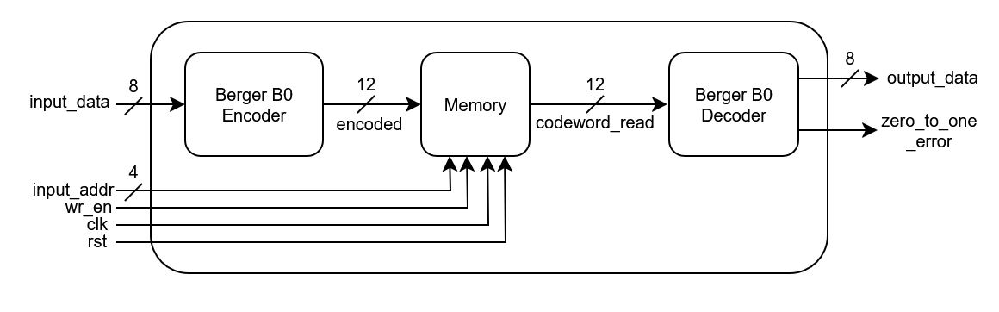
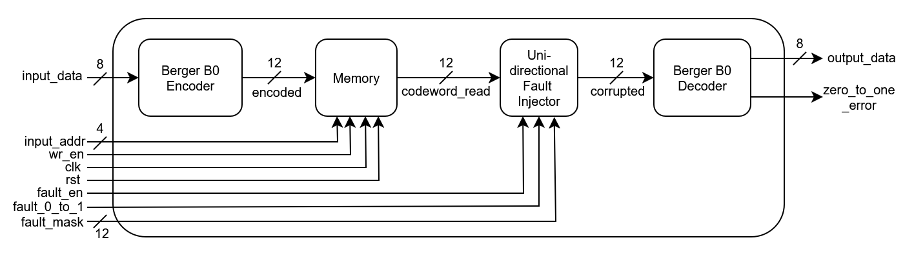

# 🧠 Berger B0-Protected Memory System

This project implements a **Berger B0 code** scheme for protecting memory from **unidirectional 0->1 bit-flip faults** in hardware using Verilog. It features:

* Berger(12,8) encoding and decoding logic
* A simple memory model that stores encoded data
* A unidirectional fault injector to simulate 0->1 bit-flips only
* A decoder that can **detect unidirectional errors** (no correction)
* A comprehensive testbench for functional verification

---

## 📘 Berger Code: Overview

Berger codes are **unidirectional error detection codes** that count the number of zero bits in the data and encode that count in binary as redundant bits. They are well-suited to detect faults that cause bits to flip only in one direction (e.g., 0->1).

We use the **Berger(12,8)** configuration:

### Parity Bit Positions (Berger(12,8)):

| Bit Index | 11 | 10 | 9  | 8  | 7  | 6  | 5  | 4  | 3  | 2  | 1  | 0  |
| --------- | -- | -- | -- | -- | -- | -- | -- | -- | -- | -- | -- | -- |
| Contents  | D7 | D6 | D5 | D4 | D3 | D2 | D1 | D0 | B3 | B2 | B1 | B0 |

* `D0–D7`: Data bits
* `B3-B0`: Berger code bits representing the count of zero bits in the data

---

## 📂 Project Structure

```
.
├── src/
│   └── berger_zero/
│       ├── berger_zero_encoder.v           # 8-bit to 12-bit Berger encoder
│       ├── berger_zero_decoder.v           # Decoder with unidirectional error detection
│       ├── mem_berger_zero.v               # Simple 12-bit memory model
│       ├── unidirectional_error.v          # Fault injector for 0->1 bit flips only
│       ├── berger_zero_memory.v            # Memory wrapper (normal)
│       └── berger_zero_faulty_memory.v     # Memory wrapper with fault injection
│
├── tb/
│   └── berger_zero_tb.v                    # Testbench with functional scenarios
│
├── images/
│   ├── berger_zero_memory.png              # Diagram of normal memory
│   └── berger_zero_faulty_memory.png       # Diagram with unidirectional fault injection
│
└── README.md
```

---

## 🧠 Architecture Diagrams

### ✅ Berger B0 Memory



### ✅ Berger B0 Faulty Memory



---

## 🔩 Key Modules

### 🔹 `berger_zero_encoder`

* Inputs: `input_data [7:0]`
* Output: `output_code [11:0]`
* Counts zeros in data and appends binary zero-count (4 bits) as Berger code.

### 🔹 `berger_zero_decoder`

* Input: `in_code [11:0]`
* Outputs: `out_data [7:0]`, `error_detected`
* Checks if the zero count in data matches the appended Berger code bits.
* Detects unidirectional errors (0→1), no correction.

### 🔹 `mem_berger_zero`

* Synchronous memory module storing 12-bit Berger codewords.

### 🔹 `unidirectional_error`

* Injects unidirectional 0→1 errors at specified bits when enabled.

### 🔹 `berger_zero_memory`

* Top-level module: encoder + memory + decoder without fault injection.

### 🔹 `berger_zero_faulty_memory`

* Includes `unidirectional_error` fault injector before decoder.

---

## ✅ Features Tested

* Correct encoding and decoding of 8-bit data with Berger code
* Unidirectional fault injection (0→1) at any bit in the 12-bit codeword
* Error detection for multiple simultaneous 0→1 bit-flips
* Memory write/read cycles with and without faults
* Latch-free, fully synthesizable Verilog code
* Waveform verification for visual inspection

---

## 🚀 Future Extensions

* Implement Berger B1 or bidirectional Berger codes for broader error detection
* Add error correction capabilities or combine with other ECC schemes
* Parameterize bit-width for general Berger code support
* Formal verification with SystemVerilog Assertions (SVA)
* Integration into larger memory subsystems with ECC support

---

## 🛠️ Usage (Vivado)

1. Open Vivado and create a new project
2. Add all files from `src/berger_zero/` as sources
3. Add `berger_zero_tb.v` from `tb/` as simulation source
4. Run simulation to observe error detection behavior with/without faults
5. Use waveform viewer to analyze encoding, fault injection, and detection signals

---

## 📜 License

Licensed under the **MIT License** – free to use, modify, and distribute.

---

## 🤝 Contributions

Pull requests, feature additions, and bug reports are welcome.
Let me know if you'd like to contribute diagrams, testbenches, or extensions!
